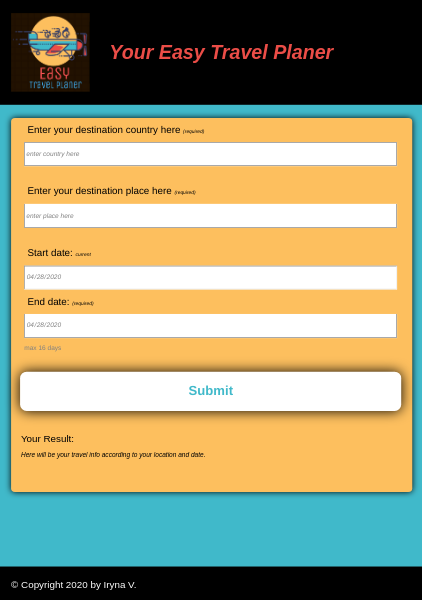

# Travel App Project

## Overview

The project goal is to help user plans his travel. User allow to plan travel only within 16 days because of API limitations (paid access require 
to choose period longer than 16 days). In scope of application used the following API: Geonames, Weatherbit, Pixabay. Solution available for all modern browsers
on desktop, tablets, phones and covered with both UI and API tests.

### Installation Prerequisites
* Node.js 12+
* NPM 6+

### Dependencies

**express.js** - HTTP server.

**webpack** - bundler for javascript.

**jest** - JavaScript test framework.

### Application Structure

**src/server** - include API files, where *index.js* - the entry point to our application.
**src/client/js** - include files to bundle client application.
**src/client/views** - HTML template.
**src/client/styles** - application styles such as Sassy Cascading Style Sheets.
**src/client/image** - application images.

### Getting started

To get the application running locally:
* clone this repo
* update server configuration, such as GEO names user, Weatherbit API key, Pixabay API key defined in `process.env` file
    * to register account for GEO names follow instructions at http://www.geonames.org/export/web-services.html
    * to create API Key for Weatherbit use following instruction https://www.weatherbit.io/api
    * to create API Key for Pixabay register account at https://pixabay.com/accounts/register/
* `npm install` (to install all required dependencies)
* `npm run build-prod` (build app)
* `npm run start` (run server)
* `npm run test` (run all tests)

